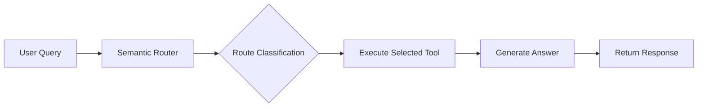

# Router Agent - Semantic Routing for Intelligent Tool Selection

Question → Router (LLM) → Tool Selection → Tool Execution → Answer Generation

## Overview

The **Router Agent** is a semantic routing system that intelligently directs user queries to the most appropriate data source or tool. Instead of using traditional agentic workflows with multiple decision points, it employs a single-step routing mechanism powered by an LLM to classify queries and execute the corresponding tool.

## How It Works

The Router Agent follows a simple three-step process:



### Step-by-Step Workflow

1. **Query Routing** 🧭
   - User submits a question
   - LLM analyzes the question and classifies it using structured output (`RouteQuery` schema)
   - Returns the most relevant datasource name

2. **Tool Execution** 🔧
   - Selected tool is invoked with the user's query
   - Tool retrieves relevant context from its specific data source
   - Returns raw context/information

3. **Answer Generation** 💬
   - LLM synthesizes the retrieved context
   - Generates a concise, informative answer
   - Returns final response with metadata

## Available Routes

The Router Agent supports **6 different data sources**:

| Route | Description | Use Cases |
|-------|-------------|-----------|
| `langgraph_docs` | LangGraph documentation from URLs | Questions about LangGraph, LangChain workflows, state graphs, agents |
| `pdf_whitepaper` | PDF document retrieval | Questions about agent quality, evaluation, benchmarks |
| `personal_info` | Text file with personal information | Questions about Abhiram Kumar Soni |
| `wikipedia` | Wikipedia search | General knowledge, historical facts, definitions |
| `arxiv` | ArXiv research papers | Academic research, scientific topics |
| `web_search` | DuckDuckGo web search | Current events, recent information, general queries |

## Key Components

### 1. RouteQuery Schema

```python
class RouteQuery(BaseModel):
    datasource: Literal[
        "langgraph_docs",
        "pdf_whitepaper", 
        "personal_info",
        "wikipedia",
        "arxiv",
        "web_search"
    ]
```

Pydantic model that enforces structured output from the LLM, ensuring valid route selection.

### 2. RouterAgent Class

**Main Methods:**

- `__init__()`: Initializes LLM, tools, and routing chain
- `_create_router()`: Creates the semantic routing chain with prompt template
- `_execute_tool(tool_name, query)`: Executes the selected tool
- `_generate_answer(question, context)`: Generates final answer from context
- `query(question)`: Main entry point - orchestrates the entire workflow

**Return Format:**

```python
{
    "answer": "Generated response",
    "route": "selected_datasource",
    "context": "Retrieved context (truncated to 500 chars)"
}
```

## Advantages

✅ **Simple & Fast**: Single routing decision, no complex state management  
✅ **Predictable**: Direct mapping from query to tool  
✅ **Transparent**: Returns which route was selected  
✅ **Extensible**: Easy to add new routes/tools  
✅ **Efficient**: Minimal LLM calls (2 per query: routing + generation)

## Comparison with Agentic RAG

| Feature | Router Agent | Agentic RAG |
|---------|--------------|-------------|
| Decision Points | 1 (routing only) | Multiple (agent, grading, rewriting) |
| Complexity | Low | High |
| State Management | None | Full state graph |
| Tool Selection | Semantic classification | Iterative agent decisions |
| Query Refinement | No | Yes (query rewriting) |
| Best For | Clear, single-source queries | Complex, multi-step reasoning |

## Usage Example

```python
from router_agent import RouterAgent

# Initialize agent
agent = RouterAgent()

# Query the agent
result = agent.query("What is LangGraph?")

print(f"Route: {result['route']}")        # langgraph_docs
print(f"Answer: {result['answer']}")      # Generated response
print(f"Context: {result['context']}")    # Retrieved context
```

## When to Use Router Agent

**Use Router Agent when:**

- Queries map clearly to specific data sources
- Speed and simplicity are priorities
- You need transparent routing decisions
- Single-tool execution is sufficient

**Use Agentic RAG when:**

- Queries require multi-step reasoning
- Document quality grading is needed
- Query refinement/rewriting is beneficial
- Complex decision-making is required

## Configuration

The Router Agent uses tools defined in `src/tools.py` and configuration from `configuration/configuration.py`:

- **PDF_FILE**: Path to PDF whitepaper
- **TEXT_FILE**: Path to personal information text file
- **URLS**: List of LangGraph documentation URLs

## Testing

Run the built-in test suite:

```bash
python router_agent.py
```

This executes test queries demonstrating routing to different data sources.

---

**Created by:** Abhiram Kumar Soni  
**Part of:** Multi-Source Tool Retriever using LangGraph
